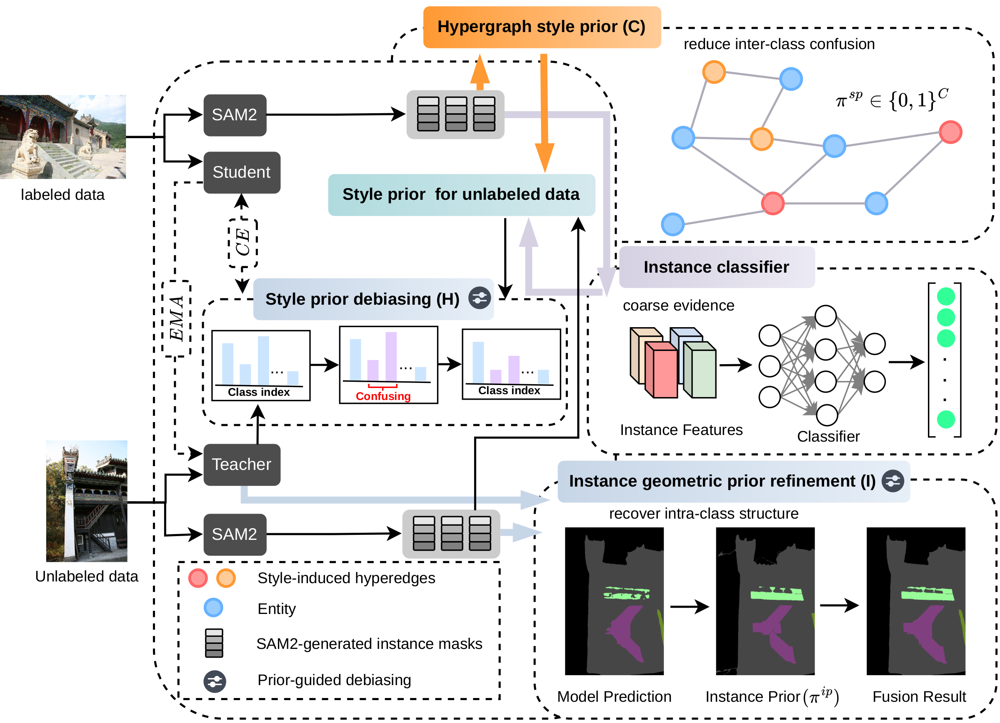

# C-PGS

Official implementation and reproducibility code for **“C-PGS: Causal Prior-Guided Style-Aware Semi-Supervised Semantic Segmentation for Ancient Chinese Architecture.”**



## Release scope

This is the public, source-only repository. It contains the C-PGS algorithms, the official UniMatch-V2 baseline, the C-PGS UniMatch-V2 integration, ACA split manifests, installation scripts, tests, and the representative model-evaluation entry point. Dataset images, annotations, generated priors, classifier weights, SAM2 checkpoints, and segmentation checkpoints are intentionally not tracked in GitHub. They are supplied separately for authorized evaluation.

C-PGS-authored code uses the MIT License. Applicable notices for retained third-party source are included in `THIRD_PARTY_NOTICES.md`.

## Quick start (Ubuntu 22.04.1 LTS or later)

```bash
bash install.sh
.venv/bin/python -m unittest discover -s tests -v
```

The installation script creates `.venv` and installs the pinned dependencies for the representative evaluation. The second command runs deterministic CPU tests for the SP and IP implementations. Full training dependencies are listed separately in `requirements-full.txt`.

Before publishing a release folder, run `python scripts/check_release.py`. It
checks the single-entry training layout, split counts, required notices, and
the absence of datasets, weights, caches, logs, private paths, and author
contact addresses.

The selected model-level GRSI target is the 1/2-labeled UniMatch-V2 + SP checkpoint. Its `model_ema` state was re-evaluated on all 145 validation images and produced mIoU 64.48 with SP only and 65.16 after enabling IP; both exactly match the paper.

After receiving the external evaluation assets, place them at the fixed paths below and run the no-argument evaluator:

```text
data/ACA/                                      # ACA images, semantic labels, instance-ID maps
checkpoints/unimatch_v2_sp_aca_1_2_best.pth   # representative checkpoint
```

```bash
.venv/bin/python evaluate_representative.py
```

The script verifies the checkpoint SHA-256, evaluates all 145 images once, reports SP and SP+IP separately, and writes `outputs/representative_results.csv` and `.md`. The expected checkpoint SHA-256 is `347db73172344905182250feef1dddd5bd506bb516b8fdc716274425a88741fc`.

Detailed GRSI reviewer instructions, including the confidential asset overlay, are provided in `docs/GRSI_REPRODUCTION.md`.

For a lightweight developer installation:

```bash
python -m pip install -e .
python -m unittest discover -s tests -v
```

## Repository layout

```text
C-PGS/
├── src/cpgs/                         # clean, reusable SP/IP implementation
├── configs/aca.yaml                  # paper protocol and portable paths
├── data/splits/aca/                  # 82/164/327/654 labeled splits + validation
├── experiments/
│   ├── baseline/unimatch_v2_official # official baseline from the supplied ZIP
│   └── integrations/unimatch_v2      # runnable, parameterized C-PGS integration
├── third_party/sam2/                 # vendored SAM2 source; checkpoints excluded
├── scripts/                          # reproducibility utilities
├── assets/                           # full framework image + 250x250 GRSI thumbnail
├── docs/                             # paper results and paper-to-code mapping
└── tests/                            # CPU-only deterministic tests
```

The GRSI package retains only the official UniMatch-V2 baseline and the C-PGS-modified UniMatch-V2 integration needed for representative reproduction. Full snapshots of Beyond-Pixels, CSL, DAW, DDFP, CorrMatch, MCCL, RankMatch, and UniMatch are not distributed; their accepted-paper measurements remain recorded in `docs/PAPER_RESULTS.md`. `AllSpark-main` is also excluded because it is not one of the paper's experiment models.

## Paper protocol

- Dataset: ACA, 1,308 training images and 145 validation images, 18 classes.
- Labeled subsets: 1/16 (82), 1/8 (164), 1/4 (327), and 1/2 (654).
- Main model: UniMatch-V2 with DPT and DINOv2-S.
- Training: 80 epochs, crop size 322 × 322, batch size 8 per GPU on four NVIDIA Tesla V100 GPUs.
- Pseudo-label confidence threshold: 0.95.
- Paper defaults: style-prior strength `alpha=0.6`, Algorithm 1 inclusive support bounds `tau_l=1` and `tau_h=3`, instance dominance `eta=0.6`, and normalized expansion `r=0.6`.
- The author confirmed `tau_l=1`, `tau_h=3`, and `kappa=100`; therefore Algorithm 2 uses `R=floor(100r)=60` pixels at the default `r=0.6`.

## ACA data placement

Source-image access: Institute of Automation, Chinese Academy of Sciences data portal, <http://vision.ia.ac.cn/data/>. For CASIA source-image access, contact `wgao@nlpr.ia.ac.cn`. Pixel-level ACA annotations were created by the C-PGS authors and are not publicly released.

Place the dataset under `data/ACA` or change `dataset.root` in `configs/aca.yaml`. Every line in `data/splits/aca/*.txt` now uses a path relative to the ACA parent directory, for example:

```text
Fayu_temple_of_mount_Puto_voc/JPEGImages/400001.jpg Fayu_temple_of_mount_Puto_voc/SegmentationClassNpy/400001.npy
```

The dataset is intentionally excluded from GitHub. For authorized evaluation, place the separately supplied ACA tree at `data/ACA`. Each semantic label under `SegmentationClassNpy` must have a same-named instance-ID array under `InstanceClassNpy`.

## Source-of-truth policy

`src/cpgs` is the clean paper-facing implementation of Algorithms 1 and 2. `src/cpgs/experiment_ip.py` separately preserves the additional safeguards used by the verified representative evaluation. The two retained directories under `experiments` are the official UniMatch-V2 baseline and the runnable C-PGS integration. The integration uses one `train.py` entry point for all four labeled ratios; use the root-level evaluation entry point for the no-argument representative check.

## Training

The representative result uses the provided pretrained checkpoint because the paper training run takes substantially longer than the GRSI evaluation window. The complete training protocol, data splits, hyperparameters, and unified UniMatch-V2 command are documented in `docs/TRAINING.md`.

## Large files

Large assets are not committed. The vendored SAM2 downloader remains available at `third_party/sam2/download_ckpts.sh`; the representative segmentation checkpoint and ACA evaluation data are supplied separately. `configs/assets.example.yaml` records the required filenames, locations, state-dictionary key, paper targets, and checkpoint checksum.

## Citation

The final BibTeX entry will be added after publication metadata is available.
